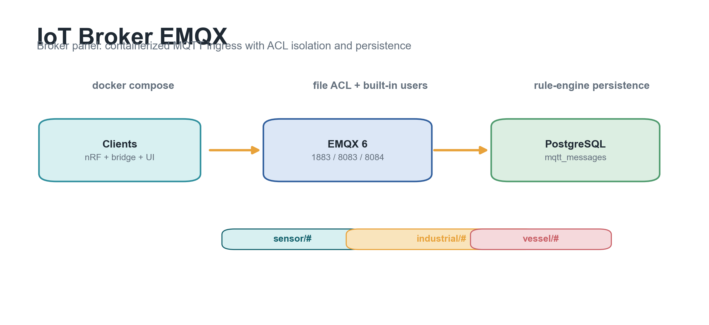

# IoT Broker EMQX



> 中文：Docker 化的 EMQX MQTT broker 基线，提供项目级 ACL 隔离、内置用户初始化和 PostgreSQL 消息持久化。
>
> English: Dockerized EMQX MQTT broker baseline with project-level ACL isolation, built-in user bootstrap, and PostgreSQL message persistence.

## 中文简介

这个仓库是 Nordic IoT Lab 的服务器/broker 基线。它用 Docker Compose 部署 EMQX 6、可选 PostgreSQL 和用户初始化脚本，适合给 nRF/NB-IoT 设备、CoAP bridge、Web 面板提供统一 MQTT 入口。

当前包含：

- MQTT TCP `1883`
- MQTT TLS `8883`
- MQTT WebSocket `8083`
- MQTT WSS `8084`
- EMQX Dashboard 账号通过 `.env` 配置，Dashboard 端口 `18083` 不直接发布到宿主机
- `init/setup.sh` 自动创建内置 MQTT 用户
- `emqx/acl.conf` 做 topic 级访问控制
- PostgreSQL `mqtt_messages` 表保存 MQTT 消息
- Docker Compose 隔离部署，不污染宿主机环境

## English Overview

This repository provides the server/broker baseline for Nordic IoT Lab. It deploys EMQX 6, optional PostgreSQL, and a user bootstrap job with Docker Compose, giving nRF/NB-IoT devices, CoAP bridges, and dashboards a unified MQTT ingress.

Included:

- MQTT TCP `1883`
- MQTT TLS `8883`
- MQTT WebSocket `8083`
- MQTT WSS `8084`
- EMQX Dashboard credentials from `.env`; dashboard port `18083` is not published to the host
- Built-in MQTT users created by `init/setup.sh`
- Topic ACL isolation via `emqx/acl.conf`
- MQTT persistence into PostgreSQL table `mqtt_messages`
- Docker-first deployment that keeps the host clean

## Quick Start / 快速开始

```bash
cp .env.example .env
docker compose up -d
```

Set real passwords in `.env` before deploying. `.env` is intentionally ignored by Git.

Check:

```bash
docker compose ps
docker compose logs -f emqx
```

Verify users and publish/subscribe paths:

```bash
set -a
. ./.env
set +a
./verify.sh
```

## Topic Isolation / 主题隔离

Default project spaces:

- `sensor/#`: nRF devices, sensor devices, and CoAP bridge publish telemetry
- `industrial/#`: nRF devices publish industrial tag telemetry
- `dashboard`: subscribe-only user for `sensor/#` and `industrial/#`
- `vessel/#`: vessel project publisher only

The ACL file is intentionally simple and file-based so it is easy to audit during early NB-IoT testing.
Device accounts are publish-only by default; dashboard readers should use the dedicated
`dashboard` account.

## Production Notes / 生产提示

- MQTT TLS is exposed on `8883` using the EMQX image certificate path by default; replace
  certificates with production broker certificates before exposing it publicly.
- Do not publish EMQX Dashboard `18083` directly. Use a VPN or an authenticated reverse proxy.
- Keep `.env` out of Git and rotate all default passwords before public deployment.
- Back up PostgreSQL volume `pg_data` if message history matters.
- Use release tags to keep broker config aligned with firmware and dashboard versions.

## Release / 版本

Current broker baseline:

```text
v0.1.3
```

Previous server deployment baseline: `v0.1.0`.
